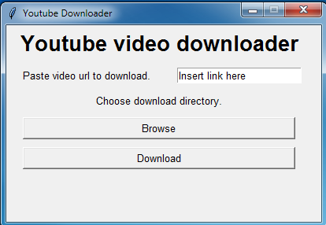
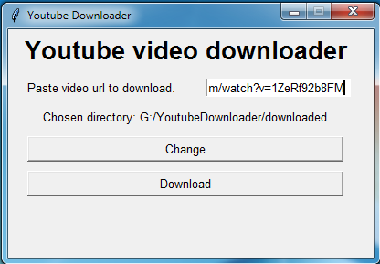
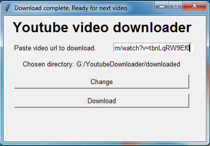
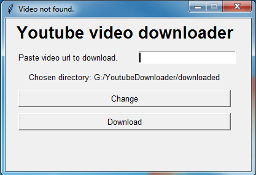
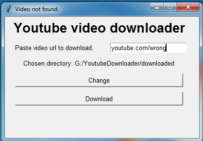
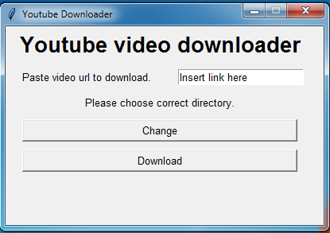

<h1>YouTube Video Downloader</h1>
 

App to download videos from YouTube

Program uses pytube library to perform main functionality and handle exceptions and tkinter library to create 
simple UI

User needs to paste YouTube link and pick download destination dictionary.

If link and destination path are correct, download might be performed

If user provides wrong link or doesn't provide it at all, application will not start download and title changes

If User did not choose download directory or chose invalid one, information displays

